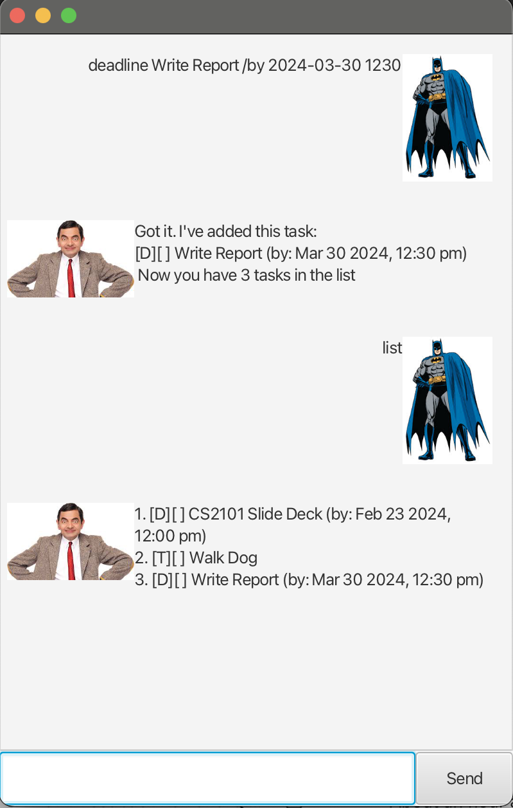

# Softess User Guide

# Softess
Your one stop task management GUI. Handle and track all your 
pending to-dos, deadlines and events easily with Softess!

## Adding Todos
`
todo Walk Dog
`

Softess would output a confirmation of the ToDo, along with the total number of tasks in your list 

## Adding Deadlines

`
deadline Write Report /by 2024-03-15 1200
`

Note: time format should **strictly** be in YYYY-MM-DD HHMM

Softess would output a confirmation of the Deadline, along with the total number of tasks in your list.
Additionally, if the date was input in the wrong format, Softess would set the deadline date to the current time.

## Adding Events 
`
event Project Meeting /from Mon 4pm /to Mon 6pm
`

Softess would output a confirmation of the Event, along with the total number of tasks in your list.
There is no strict restriction on the format for the date for events

## Viewing Tasks 
`
list
`

Softess would output a list of all tasks in the user's system, along with the status of the task.

Additionally, users can use the command `remind` to get a list of the upcoming **deadlines for the next 3 days**.
## Deleting Tasks  
`
delete 2
`

Softess would output a confirmation message of the deletion along with removing the task from the user's system
## Marking / Unmarking Tasks 
`
mark 2
`
`
unmark 2
`

Softess would output a confirmation message of marking the task.

